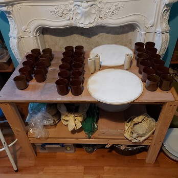
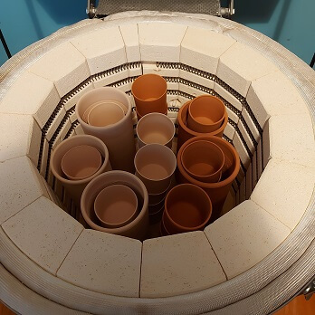
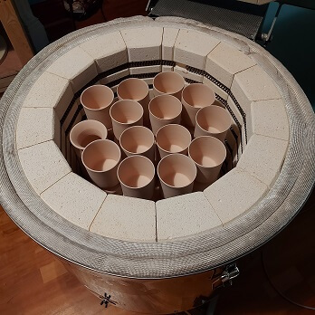

I am going to do my best to keep a kiln firing log from now on.

My kiln is a 13amp plug in top loader called [Little Chief](https://northernkilns.com/plug-in-kilns/).


| # | Type | Date | Contents | Notes |
|---|------|------|----------|-------|
| 4 | G | 04/Feb/2021 | 1 tall vase, 1 small vase, 6 yunomis  | :-1: Tall vase had chipped foot ring due to glaze contacting kiln shelf. :-1: Also it had crawling and pinholes. :warning: Be very careful when getting glaze off shelves! |
| 3 | G | 24/Jan/2021 | 33 yunomis  | Tried [Albany Slip Brown](https://www.bluematchbox.co.uk/amaco-potters-choice-albany-slip-brown.html) and [Vert Lustre](https://www.bluematchbox.co.uk/amaco-potters-choice-vert-lustre.html) (preferred). 3 coats inside and outside. Brushing Albany over Vert produced good effect but not so the other way round. |
| 2 | B | 23/Dec/2020 | 5 tall vases, 33 yunomis  | Mixture of earthenware and stoneware. 3 or 4 yunomis stacked inside and outside of vases. :+1: No broken pots after firing. |
| 1 | B | 19/Dec/2020 |  | All stoneware. |


- B = Bisque firing
- G = Glaze firing